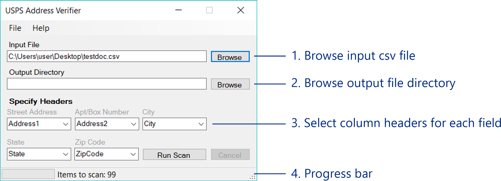

## USPS Address Verification Tool v.1

#### To-dos:

- [x] Make fields optional
- [x] Implement auto detection and selection of header fields
- [ ] Log Writer
- [x] Add more comments to code and build documentation
- [x] Finish how-to and about window

### Table of Contents

1. [Getting Started](#getting-started)
   1. [Prerequisites](#prerequisites)
   2. [Installing](#installing)
   3. [Features](#features)
   4. [About](#about)
2. [How-to](#how-to)
   1. [Setup](#setup)
   2. [Use the Tool](#use-the-tool)
3. [Code Documentation](#code-documentation)
4. [Planned Features in v.2](#planned-features)
5. [License](#license)

----

### Getting Started<a name="getting-started" />

**USPS Address Verification Tool** - a tool designed to read Comma-Separated Values files for addresses and verify them against the USPS database.
Great for cleansing database of users and validate their mailing addresses.

#### Prerequisites

- Windows 7 and/or higher
- .NET 4.5 (recommended)

#### Installing

To clone the project in your Windows machine:
1. Install [git](https://desktop.github.com/) on your machine.
2. Open Git Shell. Type in your desired directory using
```
$ cd your_directory
```
3. Clone the repository using
```
$ git clone https://github.com/IndianaCHE/USPS-Address-Verifier
```
4. Open `USPS Address Verifier.sln` using Visual Studio IDE.

Alternatively you may simply download the [portable version](USPS%20Address%20Verifier.exe) of the tool if you do not want to compile and build it yourself.

#### Features

- Takes in a csv file and genertes three csv files - one each for correct addresses, incorrect addresses, and addresses which require certain actions (missing info, multiple mailing addresses found, etc). For error and action lists the tool also generates appropriate message for every entry.

- Generates the output files in a Results folder by default. This folder is auto created in the input file directory by defailt. This can be changes anytime by specifying the output directory.

- Properly formats the mailing addresses in the format provided by USPS. For instance, the tool auto corrects `101 west ohio street` to `101 W OHIO ST`.

- Auto detects headers then auto selects them. User may change them on their own.

#### About

Tool created and maintained by [nideshchitrakar](https://github.com/nideshchitrakar).

Made using [USPS Web Tools API](https://www.usps.com/business/web-tools-apis/welcome.htm).

Utilizes the following libraries/references:
- [Csv Reader](https://www.codeproject.com/Articles/9258/A-Fast-CSV-Reader)
- [USPS API Wrapper](https://www.codeproject.com/Articles/16041/United-States-Postal-Service-USPS-Web-Tools-Wrappe)

----

### How-to

#### Setup

- First step is to register for a USPS Web Tools ID to access the API. Visit this [link](https://www.usps.com/business/web-tools-apis/welcome.htm)
and register to get an ID. You will get the ID in an email soon after filling out the registration form. The ID is a 12 digit alpha-numeric code.

- After getting your ID, launch the Address Verification tool and go to `File -> USPS ID`. Click on `Edit` and type/paste in your ID in the text box.
After that click on `Save` and choose `Done`.

- Now you are all set and you may use the tool to access the USPS Web Tools API.

#### Use the Tool<a name="use-the-tool" />

Once the setup is complete you may use the tool to validate mailing addresses from csv files.



##### 1. Opening a csv file
Click on the `Browse` button next to the Input File text box. The Windows Folder Browser opens up prompting you to
browse your file system and open a csv file.

##### 2. Specifying an output directory
By default, the output directory is the same as your input file directory. If you need to change it simply click the
`Browse` button next to the Output Directory text box.

##### 3. Selecting the column headers
Each csv file represents a table of data. Therefore, each file contains column headers and data is separated into columns. For instance,
a csv file containing address data for some people may be visualized as:

ID     | Name      | Address1      | Address2 | City         | State | ZipCode
-------|-----------|---------------|----------|--------------|-------|---------
123456 |John White | 101 W OHIO ST | Apt #314 | Indianapolis | IN    | 46204

Here `Street Address` is `Address1` column, `Apt/Box Number` is `Address2` column, `City` is `City` column, `State` is `State` column, and
`Zip Code` is `ZipCode` column.

When you load a csv file, the tool tries to detect and select the columns automatically. However the tool may not always select the correct ones,
especially if their names are not conventional. Therefore ***it is imperative*** that you select the proper column headers, otherwise the tool may
return your addresses as invalid.

After you select the proper column headers or verify that the tool selected the correct ones, you may click the `Run Scan` button to start the
validation process.

##### 4. Monitoring the progress of the tool
On the bottom of the tool's UI, there is a progress bar which gives you a real time indicaton of the scan progress. Some files may be very big (thousands of rows) and
may take time to get validated. The progress bar is there to assure you that the tool is active and working on validating your csv file.

##### Things to take note of
- You are required to have the different parts of the mailing addresses separated into different columns, i.e.,
Street Addresses, Apartment/Box Numbers, City, State, Zip Codes must all be in separate columns.
- Apartment/Box numbers are optional but the rest are required to properly validate an address.
- The headers are automatically detected and selected upon file load. The headers may not match completely all the time
due to various naming conventions. So make sure to check the header boxes before running the scan.
- Select "None" for headers which are not applicable to your file.
- If you do not specify an output directory, the tool will create a "Results" folder in the directory your input file is located in.
- It is highly recommended that you name your column headers with conventional names such as "Address1" for Street Addresses, "Address2" for Apartment/Box Info, "City", "State", "Zip" for Cities, States, and Zip Codes respectively.

----

### Code Documentation<a name="code-documentation" />

Refer to the [README](USPS%20Address%20Verifier/README.md) file in the project folder for complete code documentation.

----

### Planned Features in v.2<a name="planned-features" />

- Ability to read Excel files.

---

### License

See the [LICENSE](LICENSE.md) file for license rights and limitations (MIT).
